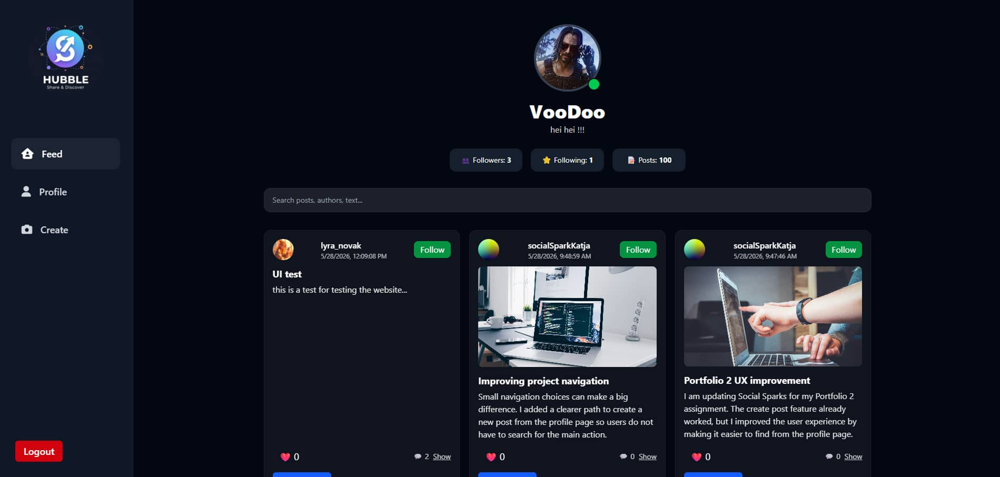

# Social Media Client — Square Pumpkin



A responsive social media client created as a group project for the **CSS Frameworks** course at Noroff. The application allows authenticated users to browse posts, view profiles, follow users and interact with social content through a modern dark-themed interface.

## Live Demo

* [View deployed application](https://bucolic-mousse-4e51e9.netlify.app/login)

## Project Overview

Square Pumpkin is a social media client built with TypeScript, Vite and Tailwind CSS, using the Noroff Social API. The project focuses on building a responsive and user-friendly interface for browsing and interacting with social content.

Users can register or log in, view a personalized feed, open individual posts, explore profile information and interact with content through available social features.

## Features

* User registration and login
* Responsive social media feed
* Profile overview with follower and following information
* Post detail pages
* Follow interaction between users
* Post reactions and comments
* Search functionality for feed content
* Mobile navigation adapted for smaller screens

## Portfolio 2 Improvement

For Portfolio 2, the project was reviewed and refined for professional presentation.

The improvement focused on:

* restructuring the feed layout for smaller screens,
* removing horizontal overflow issues on mobile devices,
* improving the visual consistency of the post detail page,
* correcting author display issues on individual posts,
* enabling follow interaction on the post detail view.

These changes improve readability, usability and overall presentation quality across devices.

## Technologies Used

* TypeScript
* Vite
* Tailwind CSS
* Noroff Social API
* Luxon
* Font Awesome
* Animate.css

## API

This project consumes the Noroff Social API:

* [Noroff Social Posts API Documentation](https://docs.noroff.dev/docs/v2/social/posts)

## Design Resources

* [Lo-Fi Design Spec](https://www.figma.com/design/YeEfWVxR4FyKKovwljxphw/Javascript-2-CA?node-id=0-1&p=f)

## Getting Started

### Prerequisites

Make sure you have installed:

* Node.js version 18 or newer
* npm

### Installation

1. Clone this repository:

   ```bash
   git clone https://github.com/Wojciech094/Social-Media-App.git
   ```

2. Navigate into the project directory:

   ```bash
   cd Social-Media-App
   ```

3. Install dependencies:

   ```bash
   npm install
   ```

4. Start the development server:

   ```bash
   npm run dev
   ```

5. Open the local URL shown in the terminal.

## Build for Production

To create a production build:

```bash
npm run build
```

To preview the completed production build locally:

```bash
npm run preview
```

## Environment Variables

If environment variables are required locally, create a `.env` file in the project root based on the configuration used by the application.

Do not commit `.env` files, API keys or private credentials to a public repository.

## Project Structure

```text
├── public/                 # Static images and assets
├── src/
│   ├── components/         # Reusable UI components
│   ├── pages/              # Feed, profile, post details and auth views
│   ├── router/             # Client-side routing
│   ├── services/           # API and post interaction logic
│   ├── types/              # TypeScript types
│   └── utils/              # Shared utility functions
├── index.html
├── package.json
└── vite.config.ts
```

## Group Project Acknowledgement

This application was originally developed as a group project.

Contributors:

* **Wojtek Leśniak** — [Wojciech094](https://github.com/Wojciech094)
* **Nirushan Rajamanoharan** — [Nirush4](https://github.com/Nirush4)
* **Tubha Ahmad**

Portfolio 2 review and presentation improvements were carried out by **Wojtek Leśniak** as part of his individual portfolio submission.

## License

This project is used for educational purposes as part of coursework at Noroff.
